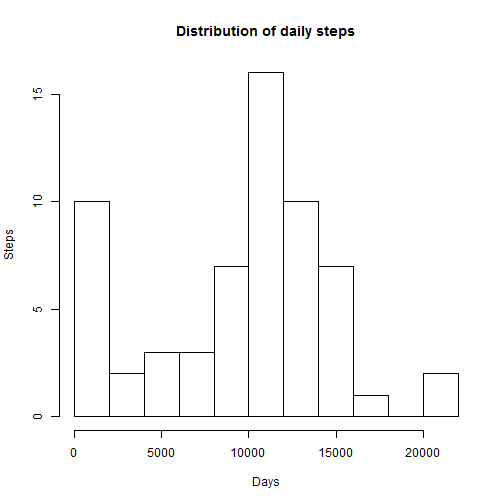
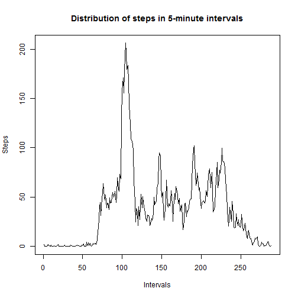
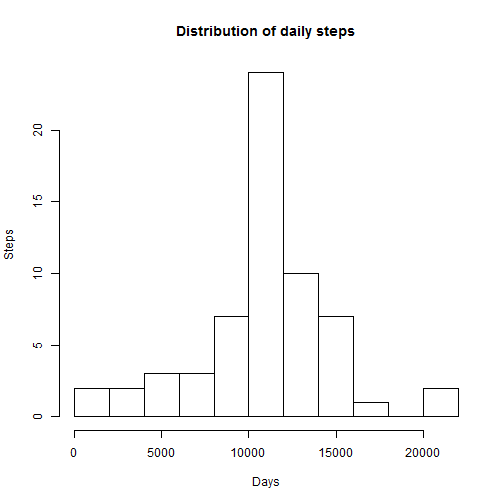
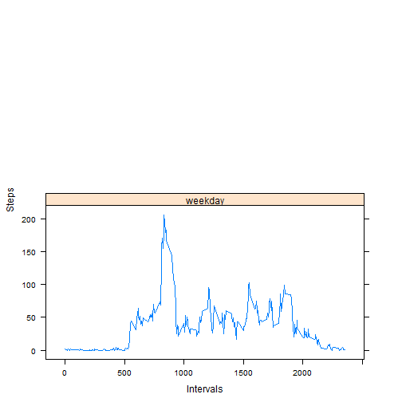

---
---

# Assignment  1

This is a report prepared to complete the assignment 1 for the 'Reproducible Research' course. The report provides answers to several questions regarding physical activities of an anonymous person based on an analysis of data from a personal activity monitoring device.

The dataset consists of data collected during the months of October and November, 2012 and include the number of steps taken in 5 minute intervals each day.
The dataset may be found on [this link](https://d396qusza40orc.cloudfront.net/repdata%2Fdata%2Factivity.zip). In total, the dataset contains 17,568 observations. The variables included in the dataset are:

* __steps__: Number of steps taking in a 5-minute interval (missing values are coded as NA)
* __date__: The date on which the measurement was taken in YYYY-MM-DD format
* __interval__: Identifier for the 5-minute interval in which measurement was taken


## Loading data


```r
require(lattice)
require(knitr)
```

```r
df <- read.csv("activity.csv")
summary(df)
```

```
##      steps                date          interval     
##  Min.   :  0.00   2012-10-01:  288   Min.   :   0.0  
##  1st Qu.:  0.00   2012-10-02:  288   1st Qu.: 588.8  
##  Median :  0.00   2012-10-03:  288   Median :1177.5  
##  Mean   : 37.38   2012-10-04:  288   Mean   :1177.5  
##  3rd Qu.: 12.00   2012-10-05:  288   3rd Qu.:1766.2  
##  Max.   :806.00   2012-10-06:  288   Max.   :2355.0  
##  NA's   :2304     (Other)   :15840
```


## What is mean total number of steps taken per day?

Calculation of the total number of steps taken per day:

```r
df.d <- aggregate(df$steps, by=list(df$date), FUN=sum, na.rm=TRUE)
names(df.d)[1] <- "date"
names(df.d)[2] <- "steps"
```

A histogram of the total number of steps taken each day:

```r
hist(df.d$steps,
     breaks = 15,
     main = "Distribution of daily steps",
     xlab = "Days",
     ylab = "Steps")
```

 

The mean and median of the total number of steps taken per day:

```r
daily.steps.mean <- round(mean(df.d$steps), 1)
daily.steps.median <- round(median(df.d$steps), 1)
daily.steps.median <- format(daily.steps.median, scientific = FALSE)
```
The mean of the total number of steps taken per day is 9354.2.
The median is 10395.


## What is the average daily activity pattern?

A plot of the 5-minute interval and the average number of steps taken (averaged across all days)

```r
df.p <- aggregate(df$steps, by=list(df$interval), FUN=mean, na.rm=TRUE)
names(df.p)[1] <- "time"
names(df.p)[2] <- "steps"

plot(df.p$steps,
     type="l",
     main = "Distribution of steps in 5-minute intervals",
     xlab = "Intervals",
     ylab = "Steps")
```

 

Selection of the 5-minute interval the contains the maximum number of steps (on average across all the days in the dataset):

```r
daily.pattern.max <- df.p[max(df.p$steps),]
daily.pattern.max <- daily.pattern.max$time
```
The 5-minute interval the contains the maximum number of steps is the interval
1705.


## Imputing missing values

Calculation of the total number of missing values in the dataset:

```r
missing.values <- sum(is.na(df$steps))
```
The total number of missing values in the dataset is 2304.

Missing values are replaced with interval means:

```r
df.r <- aggregate(df$steps, by=list(df$interval), FUN=mean, na.rm=TRUE)
names(df.r)[1] <- "interval"
names(df.r)[2] <- "steps"

df.r <- merge(df, df.r, by = c("interval") )
df.r$steps.x[is.na(df.r$steps.x)] <- df.r$steps.y[is.na(df.r$steps.x)]

names(df.r)[names(df.r)=="steps.x"] <- "steps"
df.r <- df.r[c("date", "interval", "steps")]
```

Calculation of the total number of steps taken per day based on a datased with replaced missing values:

```r
df.d <- aggregate(df.r$steps, by=list(df.r$date), FUN=sum, na.rm=TRUE)
names(df.d)[1] <- "date"
names(df.d)[2] <- "steps"
```

A histogram of the total number of steps taken each day:

```r
hist(df.d$steps,
     breaks = 15,
     main = "Distribution of daily steps",
     xlab = "Days",
     ylab = "Steps")
```

 

The mean and median of the total number of steps taken per day:

```r
daily.steps.mean <- round(mean(df.d$steps), 1)
daily.steps.mean <- format(daily.steps.mean, scientific = FALSE)

daily.steps.median <- round(median(df.d$steps), 1)
daily.steps.median <- format(daily.steps.median, scientific = FALSE)
```
The mean of the total number of steps taken per day is 10766.2.
The median is 10766.2.
Both mean and median increased.


## Are there differences in activity patterns between weekdays and weekends?
Creating a new factor variable with two levels – “weekday” and “weekend” indicating whether a given date is a weekday or weekend day:

```r
df.r$day <- weekdays(as.Date(df.r$date))
df.r$day.group <- "weekday"
df.r$day.group[df.r$day=="Saturday" | df.r$day=="Sunday"] <- "weekend"
df.r$day.group <- as.factor(df.r$day.group)
df.r <- df.r[order(df.r$interval),]
df.r <- df.r[c("date", "interval", "steps", "day.group")]
```

A plot of the 5-minute interval and the average number of steps taken, averaged across all weekday days or weekend days

```r
df.a <- aggregate(df.r$steps, by=list(df.r$interval, df.r$day.group), FUN=mean)
names(df.a)[1] <- "interval"
names(df.a)[2] <- "day.group"
names(df.a)[3] <- "steps"
```


```r
xyplot(steps~interval | factor(day.group), data=df.a, type="l",
       xlab="Intervals",  ylab="Steps", layout=c(1,2))
```

 

